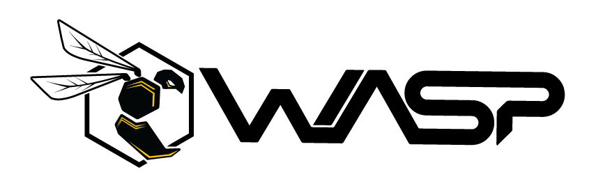

---

layout: col-sidebar
title: OWASP Thapar Institute of Engineering and Technology
tags: OWASP TIET
region: Asia
meetup-group: OWASP Thapar Institute of Engineering and Technology

---

## Welcome
Thapar Institute of Engineering and Technology (TIET) has been a steady source of highly skilled talent to the nation as well as overseas. A pioneer in engineering education, research and innovation. The team of OWASP Student Chapter, one of the gilt-edged coding society, involves ingenious mind solvers who are eager to make the world a better place to live in with their innovative techniques and discoveries. By successfully organizing many hackathons, tech-talks, workshops and coding nights, we have always strived hard to maintain the coding culture throughout the campus.

## Participation
The Open Web Application Security Project (OWASP) is a nonprofit foundation that works to improve the security of software. All of our projects ,tools, documents, forums, and chapters are free and open to anyone interested in improving application security. 

Chapters are led by local leaders in accordance with the [Chapters Policy](/www-policy/operational/chapters). Financial contributions should only be made online using the authorized online donation button. 

Everyone is welcome and encouraged to participate in our [Projects](/projects/), [Local Chapters](/chapters/), [Events](/events/), [Online Groups](https://groups.google.com/a/owasp.com/){:target='_blank'}, and [Community Slack Channel](https://owasp.slack.com/){:target='_blank'}. We especially encourage diversity in all our initiatives. OWASP is a fantastic place to learn about application security, to network, and even to build your reputation as an expert. We also encourage you to be [become a member](/membership/) or consider a [donation](/donate/) to support our ongoing work.

Next Meeting/Event <!-- You should keep this section as it will populate your meetup events -->
---------------------

### Upcoming Events

We Have Lots Of Exciting Stuff Coming Up Very Soon ! Stay Tuned To Our Media Channels ... :)

## CONNECT WITH US!

Follow and Support us on

 <a href="https://www.instagram.com/owasp_tiet/" target="_blank" > Instagram  </a>  
  <a href="https://github.com/OWASP-STUDENT-CHAPTER" target="_blank" >     Github </a>  
 <a href="https://twitter.com/Owasp_tiet" target="_blank" >   Twitter  </a>  
 <a href="https://www.linkedin.com/company/owasp-tiet/" target="_blank" >     Linkedin </a>  
 <a href="https://www.youtube.com/channel/UC_Qd7v56QH7UKp3u9Mu6Ksg" target="_blank" >    YouTube </a>  
 <a href="https://www.facebook.com/owasptsc/" target="_blank" >     Facebook </a>  

